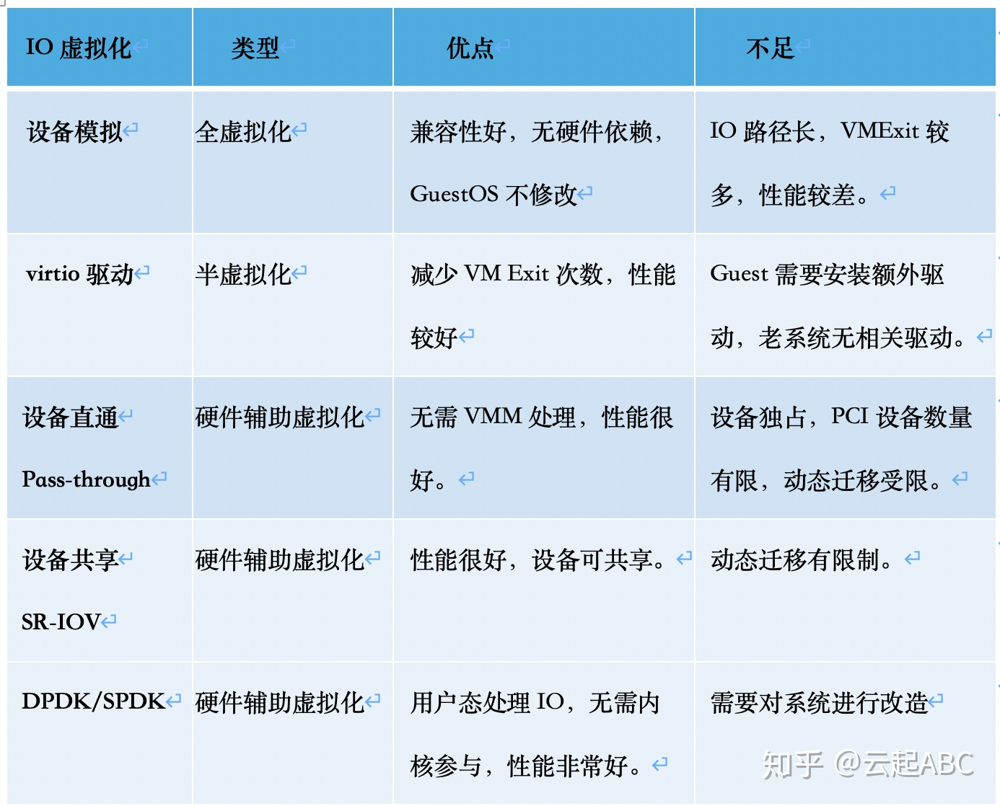

### kata涉及到的虚拟化技术 [[1]]

### 虚拟化介绍 [[2]]
- 全虚拟化: guest中执行特权指令时，VMM trap 异常, 由VMM模拟执行并返回。 不需要修改GuestOS操作系统
- 半虚拟化(Paravirtualization): 修改客户操作系统代码，将原来在物理机上执行的一些特权指令，修改成可以和VMM直接交互的方式。
- 硬件辅助虚拟化(Hardware-assistant full virtualization): Intel的VT-x和AMD的AMD-V, 引入新的指令和运行模式，使VMM 和Guest OS分别运行在不同模式（ROOT模式和非ROOT模式）下，且Guest OS运行在Ring 0下。

### IO虚拟化介绍 [[4]]

虚拟化技术发展主线是解决CPU、内存虚拟化问题; 其次重要的就是IO虚拟化问题, 也衍生出如下分类

### virtio [[3]]

- why? 如上面全虚拟化介绍，如果IO操作全由QEMU拟效率不高，可以在Guest中使用半虚拟化驱动提升IO性能
- what？IO半虚拟化通用方案, Guest需要知道自己运行在虚拟化环境中，进而根据Virtio标准和Hypervisor协作，从而提高IO性能。目前主流Linux和windows都支持virtio。
- how?
  * 前端driver 位于Guest 内核的驱动程序模块
  * 后端driver 在Host 用户空间的QEMU中实现
  * 前后端消息传输层, vring, 逻辑层
    

- 不同的IO设备虚拟化需求 对应不同的virtio模块:
  * virtio_net[[7]]是虚拟以太网卡, 是virtio迄今为止支持的最复杂的设备
    * virtio网络的演化之路: virtio ---> vhost-net ---> vhost-user [[8]]
  * virtio_fs 
  * vsock 
  * virtio-blk
  * virtio-balloon/mem

### vfio

- 需要硬件支持
- PCI设备pass-through到Guest，不经过VMM; virtio要经过VMM这一层
- 安全容器GPU，vfio-pci到虚机 [`云原生GPU`](./GPU.md)
- vfio vs. virtio(Intel 82599ES iperf测试对比) [[5]]
  
### SR-IOV

- 一个物理设备(PF)拆分成多个VF，将VF pass-through VMM 到Guest
- vfio vs. SR-IOV [[6]], 解决使用vfio设备被单个实例独占的问题

[1]: https://github.com/kata-containers/kata-containers/blob/main/docs/design/virtualization.md
[2]: https://hurray0.com/menu/50/
[3]: https://abelsu7.top/2019/09/02/virtio-in-kvm/
[4]: https://zhuanlan.zhihu.com/p/105499858
[5]: https://www.linux-kvm.org/page/10G_NIC_performance:_VFIO_vs_virtio
[6]: https://www.juniper.net/documentation/en_US/junos/topics/concept/disaggregated-junos-virtio-sr-iov.html
[7]: https://lockless.github.io/2020/03/23/Introduction%20to%20virtio-networking%20and%20vhost-net/
[8]: https://mp.weixin.qq.com/s/xRVDVn2EkQjHR7b-XpDMBw