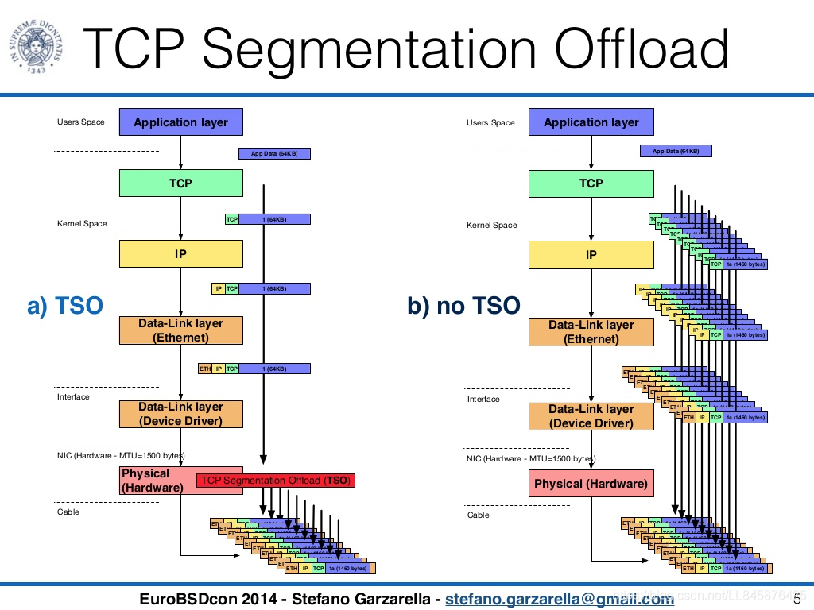
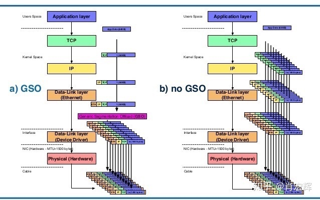

## 网络包发送过程

概览[[1]]

  

### offload

network offload，主要是指将原本在内核网络协议栈中进行的 IP 分片、TCP 分段、重组、checksum 校验等操作，卸载到网卡硬件或者网卡驱动，使得 CPU 的发包路径更短，消耗更低，从而提高处理性能。

先了解下以下基础知识作为背景，有助于理解为什么需要做offload

- Frame: Ethernet layer

  

- MTU, 一个经验值, 以太网提出的时候是按照1500字节MTU（Maximum Transmission Unit）设计的，也就是Ethernet Frame的payload（数据段）最大是1500字节。为什么是1500字节？这是一个效率和可靠性的折中选择。因为单个包越长，效率肯定越高，但相应的丢包概率也越大。反过来，单个包越小，效率更低，因为有效数据占整个网络数据比例更低，不过相应的丢包概率也更小。 因此，IEEE802.3规定了以太网的MTU是1500。
  
  

- Fragmentation: IP layer, IP协议因为MTU（Maximum Transmission Unit）的限制，会将上层传过来的并且超过MTU的数据，分成多个分片，这个过程是Fragmentation

- Segmentation: TCP/UDP layer, TCP协议在将用户数据传给IP层之前，会先将大段的数据根据MSS（Maximum Segment Size）分成多个小段，这个过程是Segmentation，分出来的数据是Segments. MSS通常是根据MTU计算，以确保一个TCP Segment不必在IP协议层再进行Fragmentation

- MSS
  - 对于TCP，MSS = 1500 - 20 - 20 = 1460
  - 对于UDP，MSS = 1500 - 20 - 8 = 1472

因为以太网MTU的限制, TCP数据要做切片, IP数据要做切片，这些切片、组装、再计算的工作严重依赖CPU，而依赖CPU正是网络性能的瓶颈所在, 所以要把这些工作offload，offload给谁呢？ 反正别让CPU做了，或者少做点，于是有了下面这些offload技术
  
  

产品里的配置
```cgo
[root@node-3 ~]# ethtool -k ens1f0np0 | grep -E "offload|tnl"
tcp-segmentation-offload: on
generic-segmentation-offload: on
generic-receive-offload: on
large-receive-offload: off
rx-vlan-offload: on
tx-vlan-offload: on
tx-udp_tnl-segmentation: on
tx-udp_tnl-csum-segmentation: on
tls-hw-rx-offload: off [fixed]
l2-fwd-offload: off [fixed]
hw-tc-offload: off
esp-hw-offload: off [fixed]
esp-tx-csum-hw-offload: off [fixed]
rx-udp_tunnel-port-offload: on
tls-hw-tx-offload: off [fixed]
```

很多中文blog 都引用了[Software segmentation offloading for FreeBSD by Stefano Garzarella](https://www.slideshare.net/eurobsdcon/20140928-gso-eurobsdcon2014), 图画得确实清晰易懂

更多内容可以看上面链接的slide, 也可以参照[肖宏辉的blog](https://zhuanlan.zhihu.com/p/44683790) 确实深入浅出，下面说几个关键技术

- TSO - TCP Segmentation Offload

  
  
  - TSO需要Checksum offload的支持，因为TCP/IP协议栈并不知道最终的网络数据包是什么样，自然也没办法完成校验和计算
  - TSO只支持TCP协议，并且需要硬件网卡的支持(GSO )
    
- GSO - Generic Segmentation Offload
  
  

  - 因为不依赖硬件，又要尽可能晚的分段或者分片，所以GSO选择在发给网卡驱动的前一刻将大包分成多个小包
  - 虽然网卡收到的还是多个小的网络数据包，但是在TCP/IP协议栈里面，还是有一段路径，CPU需要处理少量的大包
  - 因为在发给网卡驱动的前一刻完成，所以GSO可以作为TSO的备份。在发给网卡驱动时检查网卡是否支持TSO，如果支持，将大包直接传给网卡驱动。如果不支持，再做GSO。
  - 根据LinuxFoundation的文档，在MTU1500时，使用GSO可以使得网络吞吐量（throughput）提升17.5%。  
  
以上都是TX阶段的offload，RX阶段也有对应的offload技术

- LRO全称是Large Receive Offload，或者又称为RSC（Receive Side Coalescing）是TSO的逆方向实现
  - 是指网卡将同一个TCP连接的TCP Segments 合并成一个大的TCP包，再传给操作系统。这样避免了操作系统处理并合并多个小包，减少了CPU的运算时间，并且在TCP/IP协议栈，CPU需要处理更少的网络数据包。与TSO一样，LRO也需要网卡的支持。
  - LRO只能基于当前获取到的有限数据和信息做出合并，存在一定的困难。这就像我们拆一个东西很容易，但是要重新组装回去很难一样，因为LRO的局限性，在一些最新的网卡上，LRO已经被删除了。
    
- GRO全称是Generic Receive Offload，这是GSO在接收端的对应
  
  
  - GRO也更加通用，不仅不依赖硬件设备，还支持TCP协议以外的协议
    
- tx-udp_tnl-segmentation
  - 对于现代的网卡，除了TSO，GSO等offload选项外，还多了一个选项tx-udp_tnl-segmentation。如果这个选项打开，操作系统自己会识别封装成VxLAN的UDP数据是一个tunnel数据，并且操作系统会直接把这一大段VxLAN数据丢给网卡去处理。在网卡里面，网卡会针对内层的TCP数据，完成TCP Segmentation。之后再为每个TCP Segment加上VxLAN封装（50字节），如下图右所示。这样，VxLAN封装对于虚拟机网络来说，影响降到了最低
  - 从前面描述看，要达成上述的效果，需要宿主机网卡同时支持TSO和tx-udp_tnl-segmentation。如果这两者任意一个不支持或者都不支持。那么系统内核会调用GSO，将封装成VxLAN格式的大段TCP数据，在发给网卡驱动前完成TCP Segmentation，并且为每个TCP Segment加上VxLAN封装。
  - 如果关闭虚拟机内的TSO，或者虚拟机内发送的是UDP数据。那么在虚拟机的TCP/IP协议栈会调用GSO，发给虚拟机网卡驱动的前一刻，完成了分段、分片。虚拟机最终发到QEMU的网络数据包就是多个小的网络数据包。这个时候，无论宿主机怎么配置，都需要处理多个小的网络包，并对他们做VxLAN封装。
  - 我们EKS里 flannel vxlan遇到的性能问题原因
      
  
EKS虚机的offload配置
```cgo
[root@zxy-clustermas0 ~]# ethtool -k eth0 | grep -E "offload|tnl"
tcp-segmentation-offload: on
udp-fragmentation-offload: off
generic-segmentation-offload: on
generic-receive-offload: on
large-receive-offload: off [fixed]
rx-vlan-offload: off [fixed]
tx-vlan-offload: off [fixed]
tx-udp_tnl-segmentation: off [fixed]
tx-udp_tnl-csum-segmentation: off [fixed]
tls-hw-rx-offload: off [fixed]
l2-fwd-offload: off [fixed]
hw-tc-offload: off [fixed]
esp-hw-offload: off [fixed]
esp-tx-csum-hw-offload: off [fixed]
rx-udp_tunnel-port-offload: off [fixed]
tls-hw-tx-offload: off [fixed]
```
### 性能优化思路

了解了RX、TX的原理, 性能优化就有的放矢了, 但性能优化是没有通用手段的
- 张彦飞大佬的文章 [深入理解Linux网络之网络性能优化建议](https://blog.csdn.net/QTM_Gitee/article/details/125229447)
- 肖宏辉大佬的文章 [常见网络加速技术浅谈](https://zhuanlan.zhihu.com/p/44635205)

[1]: https://zhuanlan.zhihu.com/p/373060740